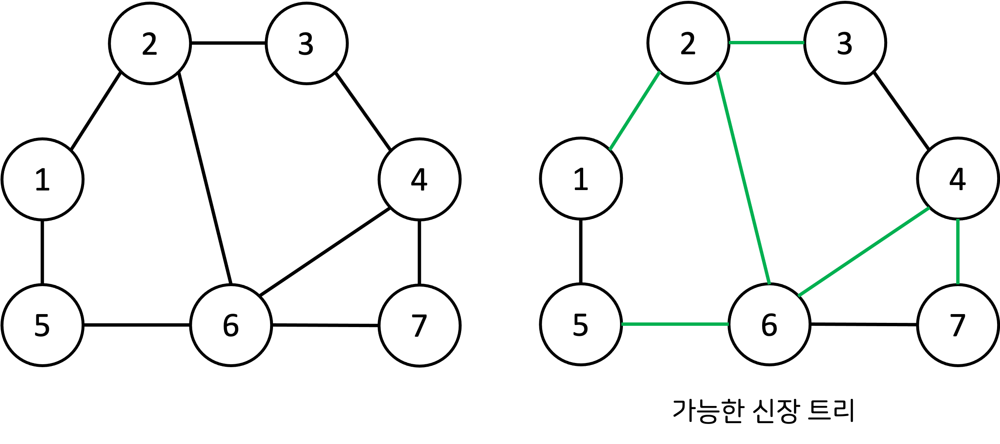

## Ch 10 그래프 이론


#### 들어가기 전
이전 5장(DFS/BFS) 와 9장(최단경로) 에서 다룬 내용은 모두 **그래프 알고리즘**의 한 유형이다.

이번 장에서는 **크루스칼 알고리즘**, **위상 정렬 알고리즘**에 대해서 배운다.

문제 풀이 팁 : '서로 다른 개체(혹은 객체) 가 연결되어 있다' → 그래프 알고리즘 (예 : '여러 개의 도시가 연결되어 있다.')


##### 🔸 그래프 vs 트리

|                     | 그래프                       | 트리             |
| ------------------- | ---------------------------- | ---------------- |
| 방향성              | 방향 그래프 or 무방향 그래프 | 방향 그래프      |
| 순환성              | 순환 및 비순환               | 비순환           |
| 루트 노드 존재 여부 | 루트 노드 없음               | 루트 노드 존재   |
| 노드간 관계성       | 부모와 자식 관계 없음        | 부모와 자식 관계 |
| 모델의 종류         | 네트워크 모델                | 계층 모델        |


##### 🔸그래프의 구현 방법

그래프의 구현 방법은 2가지가 존재한다.

노드개수(V), 간선 개수(E)

|             | 인접 행렬(Adjacency Matirx) | 인접 리스트(Adjacency List) |
| ----------- | --------------------------- | --------------------------- |
| 방법        | 2차원 배열                  | 리스트                      |
| 메모리 공간 | O(V^2)                      | **O(E)**                    |
| 찾는 비용   | **O(1)**                    | O(V)                        |

**👉 메모리와 속도(시간)을 염두에 두고 알고리즘을 선택해야 한다.**

예를 들어

9장에서 **인접 리스트를 이용한 다익스트라 최단 경로 알고리즘 / 인접 행렬을 이용한 플로이드 워셜 알고리즘** 에서

- 노드의 개수가 적은 경우 : 플로이드 워셜 알고리즘
- 노드와 간선의 개수가 모두 많은 경우 : 다익스트라 알고리즘

을 사용하면 유리하다.


#### 🌱 서로소 집합

- 서로소 집합 : 공통 원소가 없는 두 집합
- 서로소 집합 자료구조 : 서로소 부분 집합들로 나누어진 원소들의 데이터를 처리하기 위한 자료구조
- 사용 연산 : union & find
  - Union : 2개의 원소가 포함된 집합을 하나의 집합으로 합치는 연산
  - Find : 특정한 원소가 속한 집합이 어떤 집합인지 알려주는 연산


##### **1️⃣ 서로소 집합 자료구조**

서로소 집합 자료구조 구현은 **트리** 자료구조를 이용하여 집합을 표현한다. (이해를 돕기 위해 그래프로 설명)

- ##### 서로소 집합 계산 알고리즘

  ```python
  1. union 연산을 확인 -> 서로 연결된 노드 A, B 를 확인한다.
  2. A 와 B의 루트 노드인 'A', 'B' 을 찾는다.
  3. 'A' 을 'B'의 부모 노드로 설정한다.
  4. 모든 union 연산을 처리할 때 까지 (1,2,3)을 반복한다.
  ```

  전체 집합 {1, 2, 3, 4, 5, 6} 총 6개의 원소와 4개의 union 연산이 주어졌을 때,

  **번호가 작은 노드: 부모**

  **번호가 큰 노드 : 자식**

  이 되게끔 화살표를 표현해주면 다음 그림과 같다.

  

  ​	Union 연산을 함으로써 서로소 집합을 확인할 수 있다.

  ​	<이 알고리즘에서 유의할 점>

  - union 연산을 효과적으로 수행하기 위해 **부모 테이블**을 항상 가지고 있어야 한다.
   - 루트 노드를 즉시 계산 할 수 없고, **부모 테이블** 을 계속 확인하며 **거슬러** 올라가야 한다.

  **🔸 부모 테이블**

  - 초기 : 모든 원소는 자기 자신을 부모로 설정
  - Union 할 때 더 큰 루트 노드가 더 작은 루트 노드를 가리키도록 설정 (더 작은 루트 노드가 부모 노드가 된다.)

##### 2️⃣ 서로소 집합 알고리즘의 find 함수

서로소 집합 알고리즘으로 루트 노드를 찾기 위해서는 재귀적으로 부모를 거슬러 올라가야 한다.

Find 함수를 재귀적으로 불러서 답을 구할 수 있지만, 최악의 경우 모든 노드를 다 확인해야 하는 O(V) 의 복잡도가 발생한다.

이렇게 되면 Union 연산의 개수가 M개 일 때 시간 복잡도는 👉 O(VM) (비효율적)

이 문제는 **경로 압축 기법** 을 활용하면 시간 복잡도를 개선할 수 있다.


🔸 경로 압축 기법

​	find 함수를 재귀적으로 호출한 뒤에 **부모 테이블을 갱신**

##### 3️⃣ 서로소 집합을 활용한 사이클 판별

무방향 그래프 내에서의 사이클을 판별할 때 사용할 수 있다.

```python
1. 각 간선을 확인하며 두 노드의 루트 노드를 확인한다.
2. 루트 노드가 서로 다르다면 --> 두 노드에 대하여 union
3. 루트 노드가 서로 같다면 --> Cycle 발생한 것
4. 그래프에 포함되어 있는 모든 간선에 대하여 (1, 2 or 3) 을 반복
```

👉 무방향 그래프가 사이클을 포함하고 있는지/아닌지를 **서로소 집합의 union & find** 를 활용해서 알아낸다.


#### 🌱 신장 트리(Spanning Tree)

- 신장 트리 : 하나의 그래프가 있을 때 **모든 노드를 포함**하면서 **사이클이 존재하지 않는 부분 그래프**

- 다음 왼쪽과 같은 그래프에서 여러 개의 신장 트리가 있는데 오른쪽이 그 중 하나이다.

  

- 신장 트리가 아닌 경우

  .png)

  - (1) : 모든 노드를 포함하고 있지 않다.
  - (2) : 사이클이 존재한다.


##### 1️⃣ 크루스칼 알고리즘

- 신장 트리 중에서 최소 비용으로 만들 수 잇는 신장 트리를 찾는 알고리즘을 **최소 신장 트리 알고리즘**(Minimum Spanning Tree) 이라고 한다.
- 활용 예시 : 모든 도시를 '연결' 할 때, 최소한의 비용으로 연결할 때 사용할 수 있다.
- 크루스칼 알고리즘 (Kruskal Algorithm)은 대표적인 최소 신장 트리 알고리즘이다.
- 그리디 알고리즘으로 분류


**🔸 크루스칼 알고리즘**

```python
1. 간선 데이터를 비용에 따라 오름차순으로 정렬 --> 작은 것 부터 확인하게 된다.
2. 간선을 하나씩 확인하며 현재의 간선이 사이클을 발생시키는지 확인
3. 사이클이 발생하지 않는 경우 --> 최소 신장 트리에 포함
4. 사이클이 발생하는 경우 --> 최소 신장 트리에 포함시키지 X
5. 모든 간선에 대하여 (2~4) 과정 반복
```

👉 사이클 여부 조사는 위에서 배웠던 **서로소 집합** 을 활용하여 확인한다.


**🔸 크루스칼 알고리즘 과정**

(나중에 추가)

🔸 **크루스칼 알고리즘의 시간 복잡도**

- 간선의 개수가 E 일 때 → **O(ElogE)**
- 크루스칼에서 시간이 가장 오래걸리는 부분 : 간선을 정렬하는 부분


##### 2️⃣ **위상 정렬** (Topology Sort)

- 정렬 알고리즘의 일종
- **순서가 정해져 있는 일련의 작업**을 차례대로 수행해야 할 때 사용할 수 있는 알고리즘
- **방향 그래프** 의 모든 노드를 '방향성에 거스르지 않도록 순서대로 나열하는 것'
- 다시 말해, 그래프상에서 선후관계가 있다면 위상정렬을 통해 모든 선후 관계를 지키는 **전체 순서** 를 계산할 수 있다.

🔸 **위상 정렬 알고리즘**

```python
# 진입 차수 : 특정한 노드로 '들어오는' 간선의 개수
1. 진입차수가 0인 노드를 큐에 넣는다. (여러 개 가능)
2. 큐가 빌 때까지 다음의 과정을 반복한다.
3. 큐에서 원소를 꺼내 해당 노드에서 출발하는 간선을 그래프에서 제거한다.
4. 새롭게 진입차수가 0이 된 노드를 큐에 넣는다.
```

👉 위 과정을 수행하는 동안 큐에서 빠져나간 노드를 순서대로 출력하면 그것이 바로 **위상정렬을 수행한 결과**

👉 위상 정렬의 답안은 여러 가지가 될 수 있다는 점이 특징

👉 위상정렬은 **사이클의 존재여부**도 판단할 수 있다. 

​		모든 원소를 방문하기 전에, 다시 말해 큐에서 원소가 V번 추출되기 전에 큐가 비어버리면 사이클이 발생한 것.

​		왜냐면 사이클이 존재하는 경우, 사이클에 포함되어 있는 원소들은 큐에 들어가지 못하기 때문이다.

​		(2절의 실전문제에서 이 문제를 다루는 부분이 있다.)


🔸 **위상 정렬 알고리즘 과정**

(나중에 추가)

🔸 **위상 정렬 시간 복잡도**

- 모든 노드 확인 : O(V)

- 모든 간선 확인 : O(E)

  → 총 **O(V+E)**

